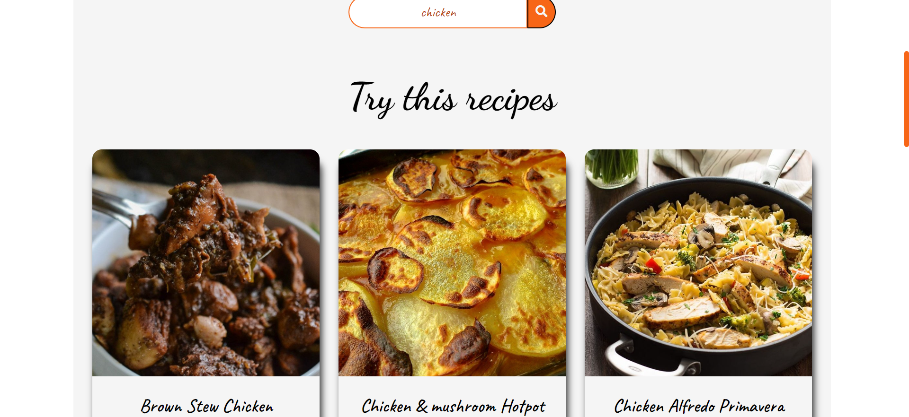

# Recipe World
Designed a simple website that display the recipe of cuisine searched by the user. It uses API to fetch data. The data recived is then converted into JSON format for easy access and then it is merged with the frontend. 

## Build With :
<ul>
    <li><a href="https://www.w3schools.com/html/" target="_blank">HTML</a></li>
    <li><a href="https://www.w3schools.com/css/" target="_blank">CSS</a></li>
    <li><a href="https://www.w3schools.com/js/" target="_blank">JavaScript</a></li>
</ul>

## Install and Run :
<ol>
    <li>Download the code and extract the zip file.</li>
    <li>Open the folder and double on the file named as <i>"index.html"</i> .</li>
    <li>You will see the page.</li>
</ol>

## API used :
``` https://www.themealdb.com/api/json/v1/1/filter.php?i=${egg} ```

``` https://www.themealdb.com/api/json/v1/1/lookup.php?i=52772 ```

## Screenshot :
<ul>
    <li>Search Bar :<br><br><br></li>
    <li>Cuisine List :<br><br><br></li>
    <li>Deatiled Recipe :<br><br><br></li>
</ul>

